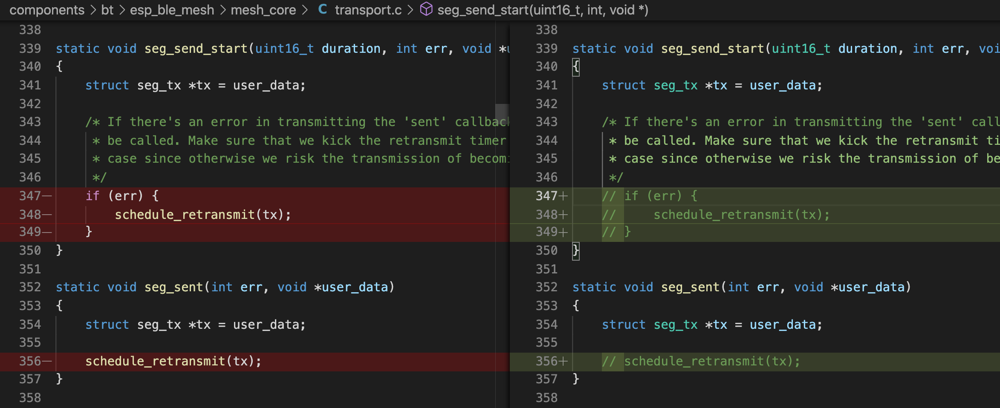
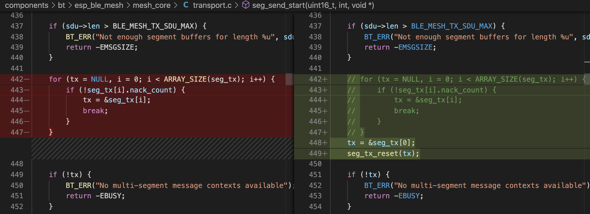
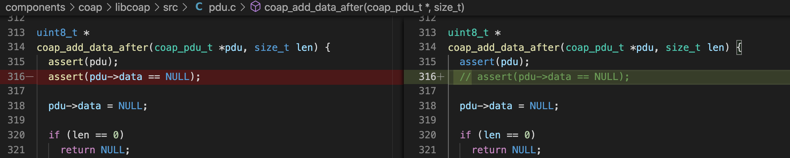

# BLE-project

include experiment 1~3

## tested envirenment

> -   manjaro KDE kernel 6.1.31-2
> -   python 3.8.16
> -   node.js 14.21.3
> -   esp-idf v4.1.3

## before start

> -   modify the esp-idf

> -   modify the [port] in index.js
>     -   windows: COM\*
>     -   linux /dev/ttyUSB\* or /dev/ttyACM\*
>     -   mac /dev/cu.\*

## common command

> -   idf.py -p [port] -b 115200 erase_flash
> -   idf.py -p [port] -b 115200 flash
> -   idf.py -p [port] -b 115200 monitoridf.py -p /dev/tty/ACM0 -b 115200 erase_flash flash monitor

## Precautions

> -   install the sd card before you turn on the client node for saveing the data
> -   use the cable connect the gateway and laptop and start the index.js which in the serial folder to save the data
